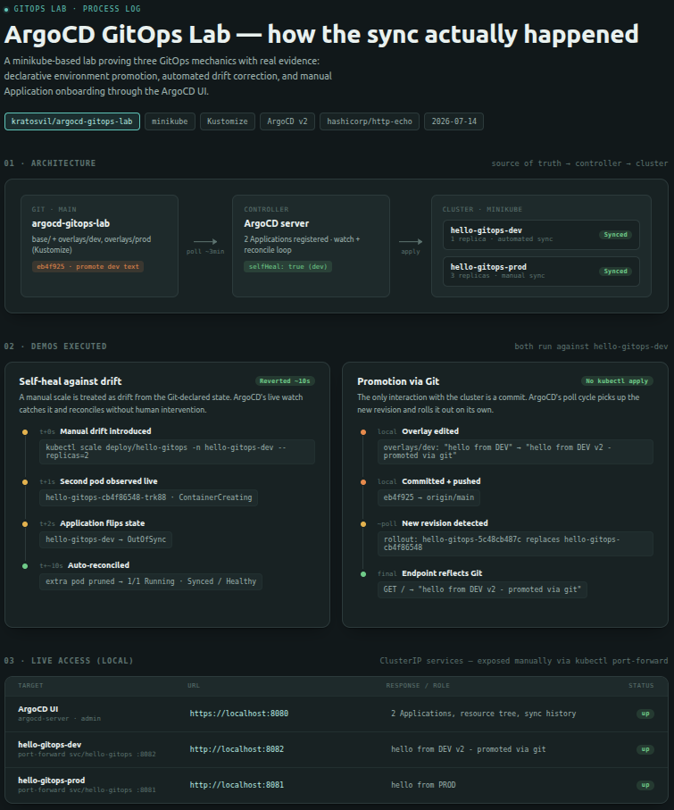

# ArgoCD GitOps Lab

Small, self-contained lab that demonstrates GitOps deployment to Kubernetes with ArgoCD: declarative environment promotion via Kustomize overlays, automated sync, and self-healing against manual drift.

**Status:** demos executed — see the process overview below.

## Why this lab

I have production experience with EKS (Terraform-provisioned clusters, Blue/Green deployments, IRSA, HPA — see [aws-eks-forge](https://github.com/kratosvil/aws-eks-forge)) but no hands-on GitOps tooling until now. This lab is a deliberately small, honest addition: it proves the ArgoCD/GitOps mechanics specifically (declarative sync, drift correction, environment promotion), not a rebuild of the EKS work.

## Architecture

```
Git repo (this repo)
  base/            → generic Deployment + Service (hashicorp/http-echo)
  overlays/dev/     → 1 replica, text "hello from DEV"
  overlays/prod/    → 3 replicas, text "hello from PROD"
  argocd/           → ArgoCD Application manifest (points at overlays/dev)

ArgoCD (running in a local minikube cluster)
  watches overlays/dev on `main`
  syncPolicy.automated: prune + selfHeal
  → any drift (manual kubectl change) is reverted automatically
  → any commit to overlays/dev is applied automatically
```

## Repo structure

```
.
├── base/                       # shared Deployment + Service
│   ├── deployment.yaml
│   ├── service.yaml
│   └── kustomization.yaml
├── overlays/
│   ├── dev/kustomization.yaml  # 1 replica
│   └── prod/kustomization.yaml # 3 replicas
├── argocd/
│   └── application-dev.yaml    # ArgoCD Application pointing at overlays/dev
└── README.md
```

## Setup

```bash
# 1. Local cluster
minikube start --cpus=2 --memory=4096

# 2. Install ArgoCD
kubectl create namespace argocd
kubectl apply -n argocd -f https://raw.githubusercontent.com/argoproj/argo-cd/stable/manifests/install.yaml

# 3. Get the initial admin password
kubectl -n argocd get secret argocd-initial-admin-secret -o jsonpath='{.data.password}' | base64 -d

# 4. Access the UI
kubectl -n argocd port-forward svc/argocd-server 8080:443

# 5. Point ArgoCD at this repo
kubectl apply -f argocd/application-dev.yaml
```

## Demos



### Self-healing (drift correction)
A manual `kubectl scale` against the deployment (1 → 2 replicas) is caught by ArgoCD's live watch and reverted automatically within ~10 seconds, without any human re-sync.

### Environment promotion via Git
Changing `overlays/dev/kustomization.yaml` and pushing to `main` triggers an automatic sync — no `kubectl apply` involved. The rollout replaces the ReplicaSet and the running pod reflects the new revision end to end.

## Cleanup

```bash
minikube delete
```
