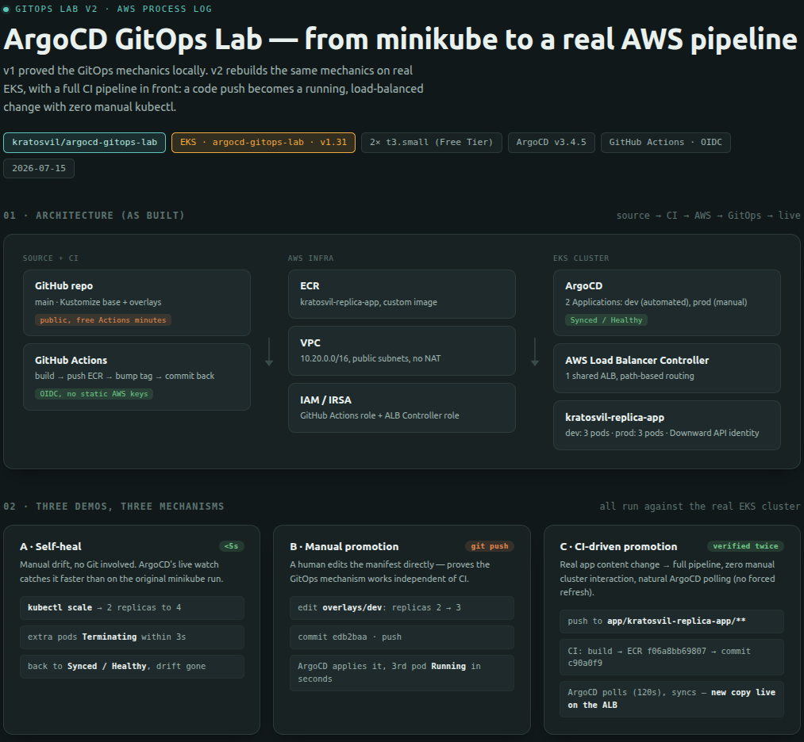
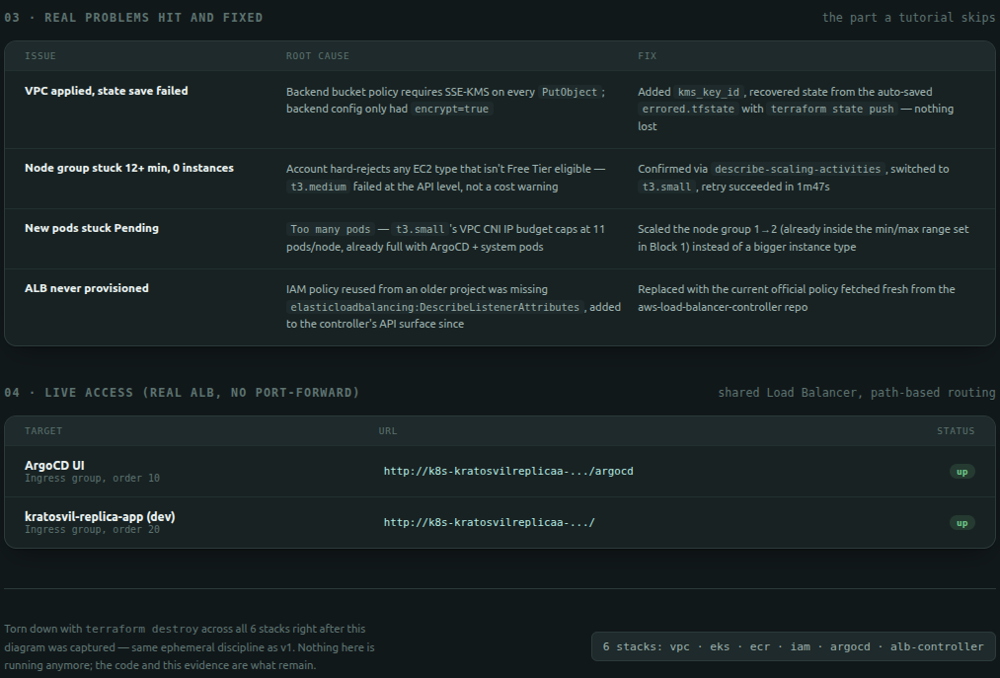

# SAGA — Sovereign Agentic GitOps Agent

An agent that reasons about real incidents on a Kubernetes/AWS cluster and remediates them by committing to Git — not just diagnosing them. The fix is validated by policy gates (dry-run + OPA + SAST/IaC/secrets scanning) before ArgoCD ever syncs it, and every resolved incident leaves behind a guardrail that prevents the same failure from recurring.

**Status: in progress.** This repo currently holds the GitOps base infrastructure (EKS + ArgoCD + CI/CD) described below, complete and verified live on AWS. SAGA is being built on top of it, module by module, per the roadmap below. No SAGA-specific code exists yet — the prerequisite is redeploying the base infrastructure.

## Why this project

SAGA fuses two things built separately:

- An incident-reasoning agent (Bedrock-based: alarm → root-cause reasoning → proposed fix → human-in-the-loop approval) that until now only executed fixes directly via AWS APIs.
- This repo's GitOps pipeline (ArgoCD + EKS + CI/CD), which until now only handled application deployments, not incident response.

The fusion changes what the agent *is*: instead of an agent that patches a resource once, it becomes an agent that manages the lifecycle of a Kubernetes platform through the same auditable, git-native path a human operator would use. Every action is a commit, every commit is reviewable, and the reasoning role never has direct write access to the cluster — only the GitOps pipeline does.

## Roadmap

Build order for v1 — the minimal slice that demonstrates the real differentiator (reason → remediate via Git → self-guard) without overrunning scope. Each module ships with its own verification step and gets folded into the architecture doc once done — nothing below is claimed as built until it's checked off.

| # | Module | Status |
|---|--------|--------|
| — | Prerequisite: redeploy EKS + ArgoCD (base infra below) | ✅ Done |
| 0 | Observability (Prometheus + Grafana + Alertmanager) | ✅ Done |
| 1 | Core: `argocd_rollback_via_git` — remediation via Git commit, gated by dry-run/OPA + Trivy/Gitleaks; live manifests moved to [`saga-gitops-manifests`](https://github.com/kratosvil/saga-gitops-manifests) (private) | ✅ Done |
| 2 | IAM separation: reasoning role is read-only; only the GitOps pipeline writes | ⬜ Pending |
| 3 | Decision gate + trust dial (fused) — three-state routing (auto-execute / auto-reject / escalate) driven by an explicit risk-classification policy | ⬜ Pending |
| 4 | Eradication phase — auto-generated guardrail policy (OPA/Gatekeeper) per resolved incident, plus loop-closure verification | ⬜ Pending |
| 9 | Illustrative scenarios (N ≥ 15-20 simulated incidents, success/failure rate, MTTR) — not called a "benchmark" to avoid implying comparability with market figures from real telemetry | ⬜ Pending |
| 11 | Demo video | ⬜ Pending |

**Deferred to v2** (commodity/UX, not the core differentiator — revisit once v1 ships): ChatOps (Slack) approvals, FinOps cost estimate in the reasoning step, multi-agent planner→critic→executor, live dashboard.

## Base: ArgoCD GitOps pipeline (complete)

A GitOps deployment pipeline for Kubernetes on Amazon EKS: ArgoCD handles declarative environment promotion, automated sync, and self-healing against manual drift, fronted by a GitHub Actions CI pipeline that builds, pushes to ECR, and promotes automatically — authenticated via OIDC, no static AWS credentials, no manual `kubectl apply`. This is the foundation SAGA builds on.

**Status:** complete. All infrastructure is provisioned with Terraform across 6 independent stacks (VPC, EKS, ECR, IAM, ArgoCD, ALB Controller), verified live on AWS, then torn down — full design rationale and build log in [docs/architecture-v2.md](docs/architecture-v2.md). An earlier local-only version (minikube) is also documented for reference.

I have production experience with EKS (Terraform-provisioned clusters, Blue/Green deployments, IRSA, HPA — see [aws-eks-forge](https://github.com/kratosvil/aws-eks-forge)) but had no hands-on GitOps tooling before this. This project proved the ArgoCD/GitOps mechanics specifically — declarative sync, drift correction, environment promotion — first cheaply on minikube (v1), then for real on AWS with a full CI/CD pipeline in front of it (v2).

### Architecture (base, current)

```
GitHub (this repo, public)
  app/kratosvil-replica-app/  → nginx:alpine, renders its own pod identity
                                 via the Kubernetes Downward API
  base/ + overlays/{dev,prod}/ → Kustomize, dev=3 replicas / prod=3 replicas
  .github/workflows/           → build image → push ECR → bump manifest tag → commit

AWS (Terraform, 6 independent stacks under terraform/)
  vpc            → 10.20.0.0/16, public subnets only, no NAT (cost)
  eks            → EKS 1.31, managed node group (Free-Tier-eligible instances only)
  ecr            → private repo for the app image
  iam            → 2 IRSA/OIDC roles: GitHub Actions → ECR, ALB Controller
  argocd         → ArgoCD via Helm, serves under /argocd on a shared ALB
  alb-controller → AWS Load Balancer Controller

Runtime (inside EKS)
  ArgoCD watches `main`, 2 Applications:
    kratosvil-replica-app-dev  (automated: prune + selfHeal)
    kratosvil-replica-app-prod (manual sync)
  1 shared ALB, path-based routing: /argocd → ArgoCD UI, / → the app
```

GitHub Actions never touches the cluster — it only reaches ECR and this repo (via OIDC, no static AWS credentials). ArgoCD is the only component with real cluster access.

### Repo structure

```
.
├── app/kratosvil-replica-app/   # the demo app (Dockerfile + HTML template)
├── base/                        # shared Deployment + Service
├── overlays/
│   ├── dev/                     # 3 replicas, Ingress, CI-managed image tag
│   └── prod/                    # 3 replicas, manual promotion
├── argocd/                      # Application manifests (dev + prod) + ArgoCD's own Ingress
├── terraform/                   # 6 stacks: vpc, eks, ecr, iam, argocd, alb-controller
├── .github/workflows/           # CI: build, push, promote dev
├── Makefile, _script.sh         # run_script runner for infra commands
└── docs/
    ├── architecture-v2.md       # full design rationale + build log (base infra)
    └── images/                  # process diagrams (v1 + v2)
```

New folders (`agent/`, `observability/`, `policies/`, etc.) will appear as SAGA modules land, following the roadmap order above.

### Setup (v2, AWS) — this is the SAGA prerequisite

```bash
# Apply in dependency order — each stack reads the previous one's state
cd terraform/vpc            && terraform init && terraform apply
cd ../eks                   && terraform init && terraform apply
cd ../ecr                   && terraform init && terraform apply
cd ../iam                   && terraform init && terraform apply
cd ../argocd                && terraform init && terraform apply
cd ../alb-controller        && terraform init && terraform apply

# Seed the first image (until CI has run at least once)
aws ecr get-login-password --region us-east-1 | docker login --username AWS --password-stdin <account>.dkr.ecr.us-east-1.amazonaws.com
docker build -t <ecr-repo>:latest app/kratosvil-replica-app
docker push <ecr-repo>:latest

kubectl apply -f argocd/application-dev.yaml -f argocd/application-prod.yaml -f argocd/ingress.yaml
```

Or via the run_script runner: `make run_script` (runs `_script.sh`, applies all 6 stacks and verifies nodes/pods).

### Setup (v1, local)

```bash
minikube start --cpus=2 --memory=4096
kubectl create namespace argocd
kubectl apply -n argocd -f https://raw.githubusercontent.com/argoproj/argo-cd/stable/manifests/install.yaml
kubectl -n argocd get secret argocd-initial-admin-secret -o jsonpath='{.data.password}' | base64 -d
kubectl -n argocd port-forward svc/argocd-server 8080:443
kubectl apply -f argocd/application-dev.yaml
```

### Demos (base infra)

#### v2 — on real AWS infrastructure




Three separate mechanisms, all verified against the running EKS cluster:

- **Self-healing** — a manual `kubectl scale` (2→4 replicas) is reverted by ArgoCD in under 5 seconds.
- **Manual promotion via Git** — editing `overlays/dev/kustomization.yaml` directly and pushing gets applied automatically, no `kubectl apply`.
- **CI-driven promotion** — a real app change pushed to `app/kratosvil-replica-app/` triggers GitHub Actions (build → ECR → bump manifest tag → commit), and ArgoCD picks up that commit through its own polling cycle and syncs — verified end to end including the rendered content actually changing on the live ALB.

The second image also documents four real problems hit during the build (a KMS backend policy mismatch, an account-level Free-Tier-only EC2 restriction, a per-node pod capacity limit, and a stale IAM policy missing a newer required permission) and how each was diagnosed and fixed.

#### v1 — on minikube


Same two demos (self-healing, promotion via Git), proven first on a local cluster before spending anything on AWS.

### Cleanup

```bash
# v2 — reverse order, since each stack depends on the previous one's state
cd terraform/alb-controller  && terraform destroy
cd ../argocd                 && terraform destroy
cd ../iam                    && terraform destroy
cd ../eks                    && terraform destroy
cd ../ecr                    && terraform destroy
cd ../vpc                    && terraform destroy

# v1
minikube delete
```

Same discipline applies to whatever SAGA adds on top: nothing stays running between sessions — spin up, verify, tear down.
